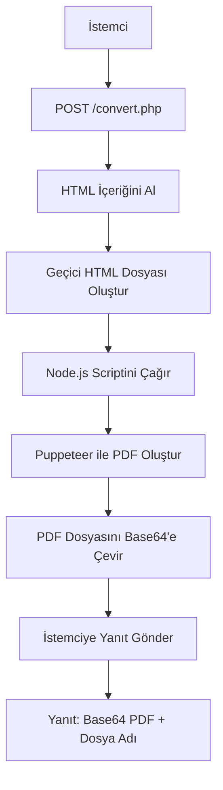

# HTML'den PDF'e Dönüştürücü

Bu proje, HTML içeriğini PDF formatına dönüştürmek için Puppeteer kullanır. Hem genel HTML belgeleri hem de e-arşiv faturaları için çalışacak şekilde tasarlanmıştır.

## Özellikler

- Herhangi bir HTML içeriğini PDF'e dönüştürür
- Özellikle e-arşiv (e-fatura) faturaları için optimize edilmiştir
- Güvenilir renderlama için Puppeteer kullanır
- Entegrasyon için basit API uç noktası

## Nasıl Çalışır

1. HTML içeriğini POST isteğiyle `convert.php` uç noktasına gönderin
2. PHP betiği HTML'i işler ve PDF oluşturmak için Puppeteer ile Node.js betiğini kullanır
3. PDF'i base64 kodlu içerik olarak döndürür

## Sistem Mimarisi



## Gereksinimler

- PHP 7.0 veya üzeri
- Node.js
- npm

## Kurulum

1. Depoyu klonlayın
2. Bağımlılıkları yüklemek için `npm install` komutunu çalıştırın (Puppeteer dahil)
3. Sunucunun PHP ve Node.js betiklerini çalıştırabileceğinden emin olun

## Kullanım

`convert.php` adresine aşağıdaki parametreyle bir POST isteği gönderin:
- `html`: Dönüştürülecek HTML içeriği

Yanıt:
```json
{
  "success": true,
  "pdf": "base64_kodlu_pdf_icerigi",
  "filename": "olusturulan_dosya_adi.pdf"
}
```

## Hata İşleme

Dönüştürme sırasında bir hata oluşursa, API şu yanıtı döndürür:
```json
{
  "error": "Hata mesajı",
  "details": "Detaylı hata bilgisi"
}
```

## Lisans

MIT